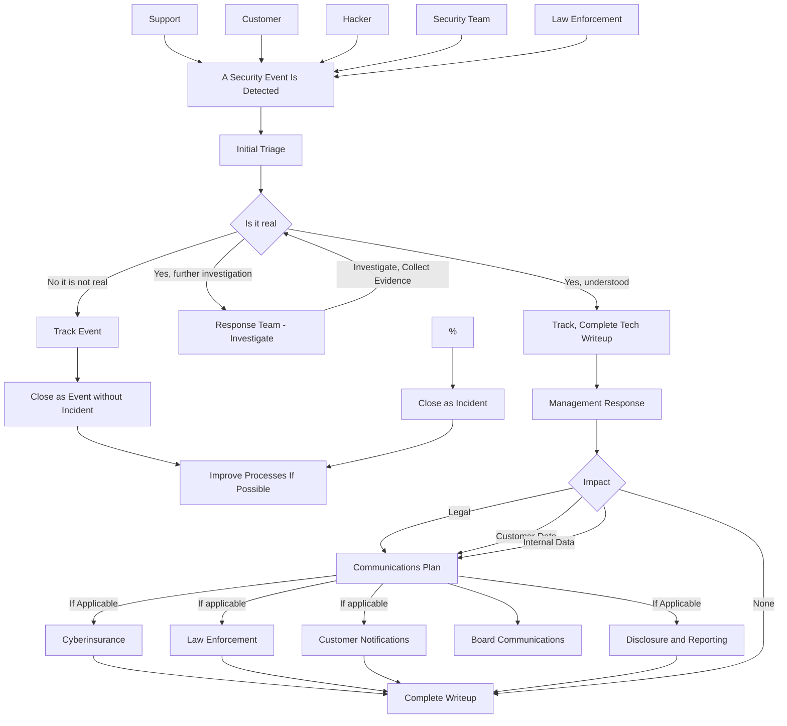
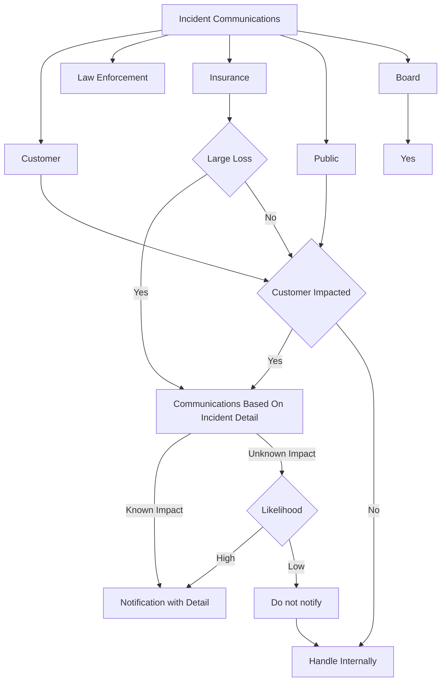
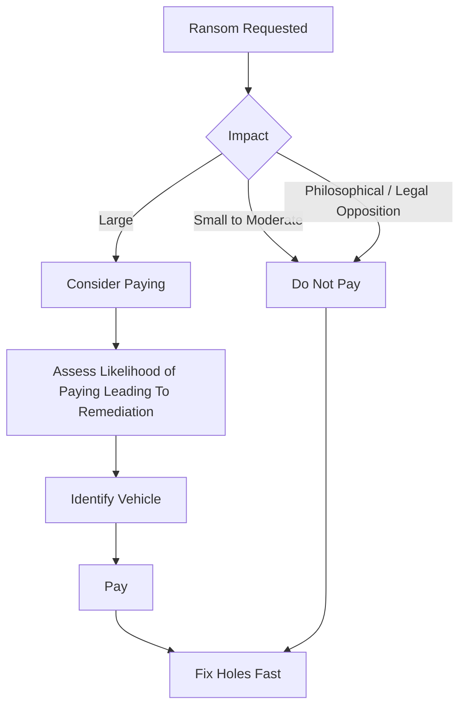

# Incident Response

This diagram captures a core incident response workflow.

## Diagram

An example flow chart for incident response.

### Notes

Ideally, we want as many ways for a potential security event to be reported
as possible.  This could be your security@ email address, it could be a
phone number, it could be a slack channel.  Basically, we want the bar for
having a security incident reported to be as low as possible.

Typically, _Initial Triage_ is done by someone on the security or
operations team.  There is usually a lot of noise.  The noise comes mostly
from tools not people, but because there is noise, we need to triage these
security items before making them a fire drill.

Once we know it may be real, we want to convene a security incident response
team (often called a SIRT).  The SIRT should be tailored to the incident.
That means the tech people pulled should be the ones that can help
investigate.  The business folks should be appropriate to the product and
customers impacted.  Generally, we don't want the information about the
incident to be circulated more widely than necessary.  This is a good place
for the "need to know basis" type of arrangement.  The SIRT may need to be
updated as information about the incident becomes known.

### Communication Plan

We may also have to think about how we communicate
about an incident.  This is an example.  Every company will vary.

### Ransoms

We may also have to ask ourselves whether we will pay a ransom?

### Disclaimer

*You should consult a security expert directly about any decisions about security response.*
