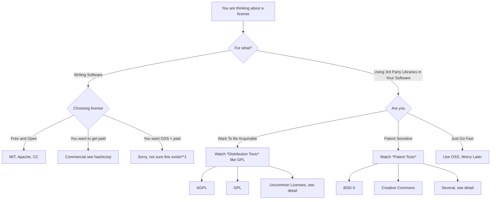

# Licenses

Understanding software licenses in the context of security is very difficult.  This diagram and the following information is intended to make it easier to follow.

## Diagram

A flow chart for understanding software licenses from a security lens.

`**1` See references, esp. [Bruce Perens interview](https://www.theregister.com/2023/12/27/bruce_perens_post_open/).

### Disclaimer

*You should consult your attorney about any decisions about software licenses.*

## Explanations

What licenses you choose or accept in your supply chain depends a
lot on what you are doing.

### Distribution Toxic

Licenses generally considered toxic include:

* AGPL
* GPL
* CeCILL Free Softweare License Agreement
* European Union Public License 1.1 and 1.2
* Open Software License 3.0

These licenses are considered toxic because in theory, modifications
must be redistributed under the same license.  So if you are a company
that is building software and distributing that software to your client,
the use of these licenses suggest that you might have to provide them
access to *your* source code too.

Most of these also have terms that indicate that "network usage" is
considered distribution.  GPL does not technically say this and so you
could (and many large software companies do) build server based
software around libraries with these licenses (eg. linux) without redistributing source code.

Attorneys worry a lot about this.  So far as I can tell, it is rarely,
if ever, applied in practice.  But it can hold up an acquistion.  So it
is definitely worth steering clear of if you have easy alternatives.

### Patent Toxic

Licenses considered patent toxic (contributors have expressly not
granted patent rights) include:

* BSD 3-Clause Clear License
* Creative Commons Attribution 4.0 International
* Creative Commons Attribution Sharealike 4.0 International
* Creative Commons Zero v1.0 Universal
* Open Data Commons Open Database License

Note that licenses don't always have clear language about patents.  These include:

zlib, VIM License, The Unlicense, PostgresQL License, SIL Open Font License, MIT License, MIT No Attribution, LaTeX Project Public License, GNU Lesser General Public License, ISC License, GNU General Public License, GNU Free Documentation License, Boost Software License, BSD 4-Clause Original or Old, BSD 3-Clause, BSD 2-Clause, BSD Zero Clause.

It is good practice to strongly separate your code from any related
library code so that you can apply licenses to your code in the way
that you would wish without being confused about.

## References

For more information about the failure of open source licenses, see:  [Bruce Perens talk about OSS](https://www.theregister.com/2023/12/27/bruce_perens_post_open/) and Post Open licenses.

For deeper background about choosing a license, check out [choosealicense ](https://choosealicense.com/licenses/) for a short
summary and [choosealicense appendix](https://choosealicense.com/appendix/) for an exhaustive table.
