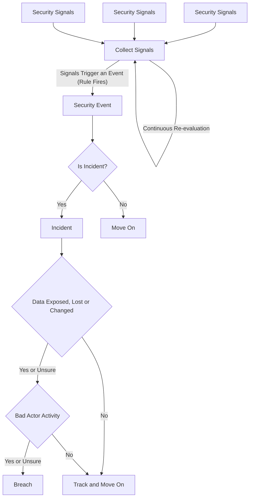
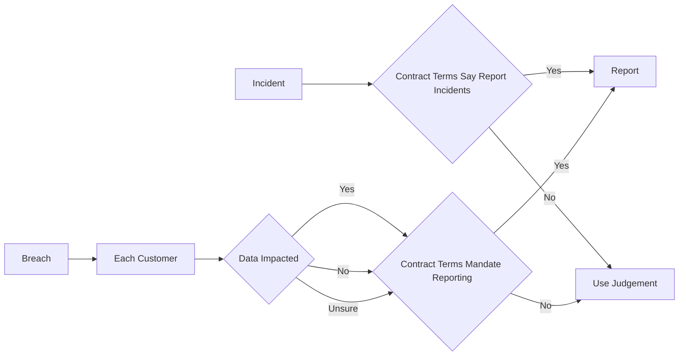

# Notification Decision Flow

This diagram captures an example decision flow around
notifying clients about security events/incidents/breaches.

This is not a trivially simple topic and there are many
ways to look at it.  In all likelihood, your legal and
and other executive team stakeholders may have strong
opinions about this topic.  This diagram can help spur
discussion.

## Diagrams

### Event, Incident and Breach Logic

An example flow chart for triaging event, incindent to breach.

### Notification Flow

Generally we need to think about whether customers were impacted
by a breach and if they were, what data might have been exposed.

Contract terms may or may not mandate reporting of a data breach
whether or not it impacts specific customer data.  It may be
worth considering reporting certain breaches in the case where
there isn't complete information or where it isn't strictly
required.

### Definitions and Notes

Some ideas about notification flows.

#### Security Events

A security event is something that happens that could be a
signal or symptom or indication of a security issue.

In most systems, it takes a correlation of different types
of semi normal events to create an indication of a security
incident.  

For example, a failed login could be a security
event.  It has very little meaning because this happens all
the time during normal operations.  However, a very large
number of failed logins for a single user might point to
a potential incident which we would want to investigate.

Generally we can't report all security events.  We may have
dozens (or thousands) of security events every day.

Hopefully our team is looking into the events and tracking them
down either programmatically or one by one to ensure that they
are not indicators of a deeper problem.

#### Incident

We think of a security incident as an event or condition that
has been confirmed to have occurred but which may or may not
involve actual loss of data.

Building on the login failures example, a large number of login
failures followed by a successful login would usually be enough
to trigger a security incident.  Something we need to really
investigate and respond to.  We still don't know for sure any
data was accessed, but we do know it looks very suspicious.

In other words, an incident might or might not become a breach.

Some types of customers want to know about incidents and build
this into contract language.  In my experience, I haven't seen
this really implemented where all types of incidents get reported, but the spirit of it is basically:  

>If you have a breach that impacts some customers but not
me, I still want to know about it.

I would want to know.  I don't necessarily think companies
handle this the way you would hope.

#### Breach

We typically think of a breach as being a security incident
that also includes actual data loss to a bad actor.

Thus, *breach criteria* could be loss of data + bad actor
specifically associated with the incident.

So for the login failure example, if we can see that someone
took certain actions in the system after a lot of failed logins
followed by a successful login and they accessed certain data
for the account they accessed - that constitutes a breach of
the system that exposed data to whoever the bad actor was.

Sometimes customers want to know about a breach within a
short time period.  Sometimes they are very clear that any
breach to your company is a breach they want to hear about.
Sometimes companies interpret this loosely and say that a
breach _that does not_ include their data doesn't need to
be reported.

### Disclaimer

*You should consult a security expert directly about any decisions about security response.*
