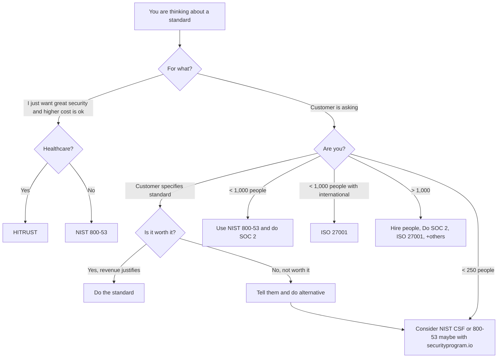
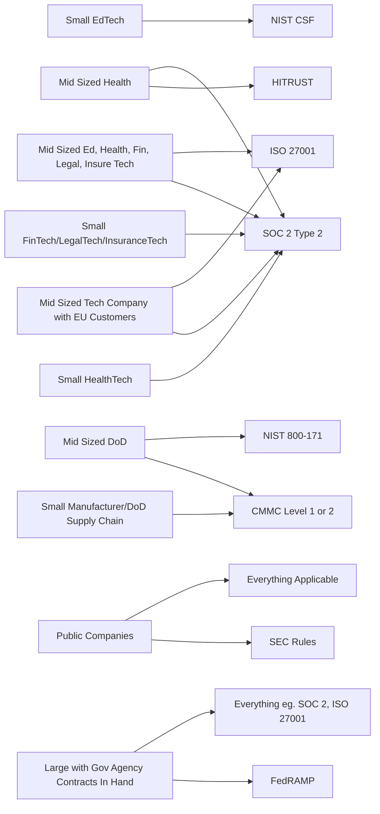

# Standards

Understanding security standards is very difficult.  This diagram and the following information is intended to make it easier to follow.

## Diagram

A flow chart for understanding security standards.

### Disclaimer

*You should consult a security expert diretly about any decisions about security standards.*
Check out our securityprogram.io tool if you want simple help.

## Associations

Note:  privacy and other core legal framework (FTC rules,
executive orders, etc.) are not included here because it 
makes the diagram unreadable.

## Explanations

There are some standards that you can leverage that are free
and open that support long term development of a security
program.  These include:

* NIST 800-53
* NIST CSF

There are other specific standards with affinities as
follows:

* CMMC is new and for DoD
* NIST 800-171 is for DoD
* SOC 2 Type 2 is widely used in US
* ISO 27001 is an international standard
* HITRUST is an adaptation of these with a closed community of auditors.  It is widely applied in healthcare, largely because HIPAA is very non-specific.

There is a lot of detail behind any of these choices and
there is probably no "one right" decision for all companies.

## References

These change a lot.