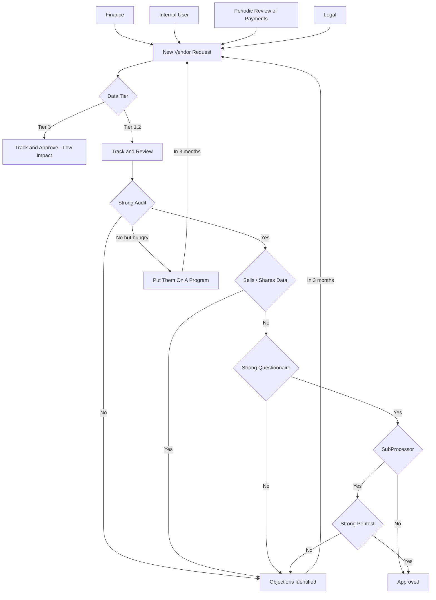

# Vendor Management

This diagram captures a basic vendor management process.

## Diagram

An example flow chart for vendor management.

### Disclaimer

*You should consult a security expert directly about any decisions about vendor management program.*
