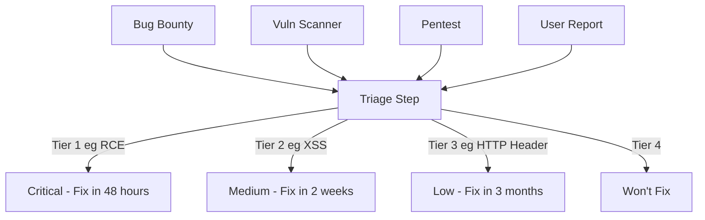

# Vulnerability Management

The basic idea with vulnerabilty management is to have a set
process to triage and manage vulnerabilities as they arise.

Vulns can come from anywhere.  So let them come and track them
in a consistent way (eg. as an issue in Jira or Github).

Then develop an agreed upon SLA (service level agreement) with
a timeframe for fixing different severity issues.

## Diagram

An example flow chart for vulnerability management.

## Notes

The key is to define the criteria for the tiers.  It can be
helpful to have examples of the types of vulns that are in
each tier.

A going in example might be something like:

| Tier | List | Notes |
|---|-------------------|--------------|
| 1 | Command Injection, SQL Injection, SSRF, Authentication Bypass | Loss of sensitive data or compute, easily weaponized |
| 2 | XSS | Less serious or more complex to attack |
| 3 | HTTP Headers, Denial of Service, Known Vuln in Dependency (but not using that function) | Deviation from best practice but low risk |
| 4 |  | Not a priority to fix |

This triage table should be agreed upon by security &
development as a standard part of the SDLC.
